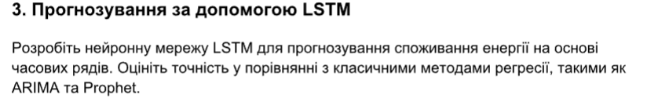
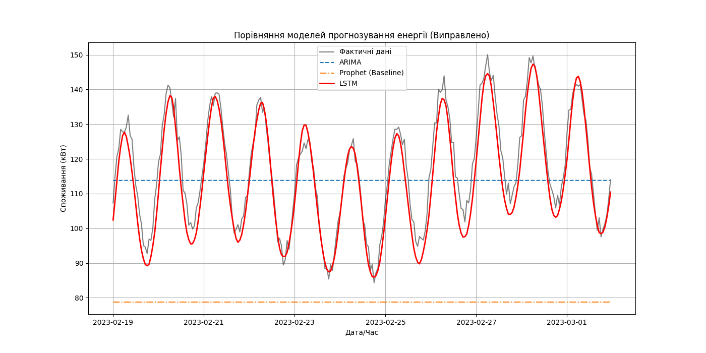

# PR4

## Варіант 3.

1. #### LSTM продемонструвала найвищу точність прогнозування. Помилка моделі ($RMSE = 4.77$) є значно меншою за класичні методи, що підтверджує ефективність архітектури Long Short-Term Memory для виявлення складних закономірностей у споживанні енергії.

2. #### ARIMA показала стабільний, але менш точний результат, оскільки лінійні статистичні моделі мають обмеження при роботі з нелінійними компонентами даних.

3. #### Технічні труднощі з Prophet підкреслюють важливість налаштування середовища (рекомендується використання Docker або WSL2 для стабільної роботи Stan-моделей на Windows).