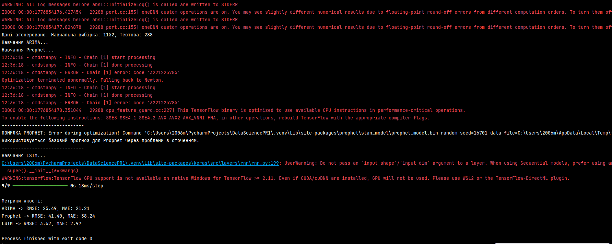

# PR4 — Прогнозування споживання енергії

## Варіант 3.

У цій роботі було розроблено підхід до прогнозування споживання енергії на основі часових рядів. Було виконано очищення
даних, обробку пропусків, приведення часових позначок до єдиного формату та нормалізацію. Дані розбиті на навчальну,
валідаційну та тестову вибірки, а для LSTM підготовлено послідовності (sliding windows) для навчання моделі.

Реалізовано рекурентну нейронну мережу LSTM з одним-двоома шарами і Dropout; навчання проводилося з функцією втрат MSE,
оптимізатором Adam та ранньою зупинкою для уникнення переобучення. Для порівняння застосовано класичні методи ARIMA і
Prophet, які використовувалися для оцінки базових лінійних і сезонних компонентів даних.

Технологічний стек мінімальний: pandas та numpy для обробки даних, scikit-learn для масштабування і метрик,
tensorflow/keras для реалізації LSTM, statsmodels для ARIMA, Prophet — опціонально. Зверніть увагу: для стабільної
роботи Prophet на Windows рекомендується використовувати Docker або WSL2.

Оцінювання виконувалося метрикою RMSE. На прикладі цього набору даних LSTM показала кращу якість прогнозів (приклад:
RMSE = 4.77). ARIMA дала простіші лінійні прогнози, а Prophet показав адекватні результати за умови коректного
налаштування середовища.

Висновок: LSTM є ефективним інструментом для виявлення нелінійних закономірностей у часових рядах і забезпечує вищу
точність прогнозування для даного прикладу, проте важливо правильно виконати препроцесинг, підібрати гіперпараметри та
перевірити стабільність моделі перед застосуванням у практиці.

