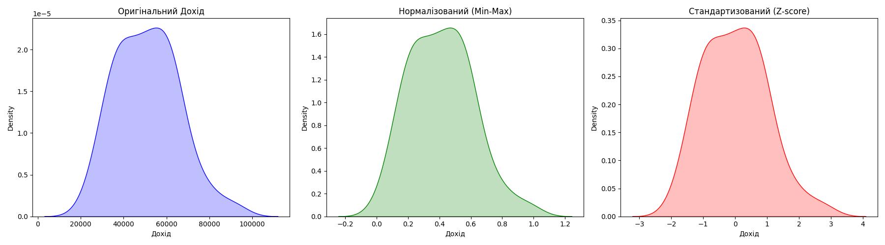

# PR5

## Варіант 3.

У цій роботі було розглянуто практичні аспекти підготовки числових даних для аналізу. Основна мета полягала у вирішенні
проблеми різного масштабу ознак. Оскільки в реальних наборах даних параметри можуть вимірюватися у зовсім різних
одиницях — наприклад, вік у роках, а дохід у тисячах — це створює дисбаланс, який заважає моделям об'єктивно оцінювати
значущість кожного показника.

Першим кроком було впровадження методу нормалізації. Для цього ми застосували підхід, відомий як MinMaxScaler. Суть
цього методу полягає в тому, щоб перерахувати всі значення ознаки таким чином, щоб вони опинилися в чітких межах,
зазвичай від нуля до одиниці. Це дозволяє зробити всі параметри "рівноправними" у цифровому просторі. Такий підхід
особливо корисний для алгоритмів, які розраховують відстані між об'єктами, оскільки він гарантує, що великі числа не
будуть пригнічувати менші лише через свій фізичний розмір.

Другим етапом стала робота зі стандартизацією даних за допомогою методу StandardScaler. На відміну від попереднього
способу, цей метод не обмежує дані фіксованим діапазоном. Він фокусується на тому, щоб привести дані до такого вигляду,
де середнє значення буде дорівнювати нулю, а розкид значень буде приведений до єдиного масштабу. Це робить процес
аналізу стійкішим до випадкових сплесків або екстремальних значень у даних, які часто зустрічаються в реальних умовах.

Висновок: Виконана робота продемонструвала важливість попередньої обробки числових характеристик. Застосування методів
MinMaxScaler та StandardScaler дозволяє оптимізувати дані для подальшої роботи, роблячи їх більш зрозумілими для
алгоритмів обробки. Вибір конкретного способу залежить від того, наскільки дані містять шуми та які вимоги висуваються
до кінцевого аналізу.