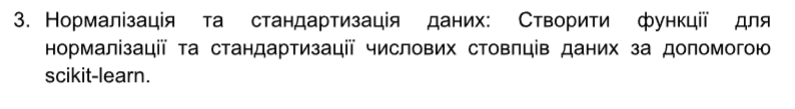
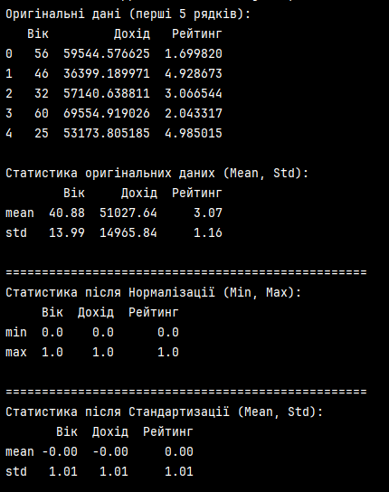

# PR5

## Варіант 3.

#### Використання `scikit-learn` дозволяє швидко та ефективно готувати дані до навчання. Нормалізація є критично важливою для моделей, де важливі відстані між точками, тоді як стандартизація є стандартним вибором для більшості статистичних методів машинного навчання.