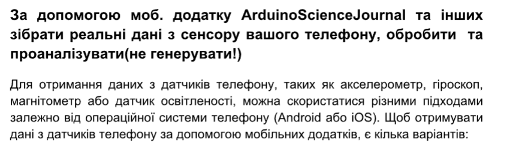
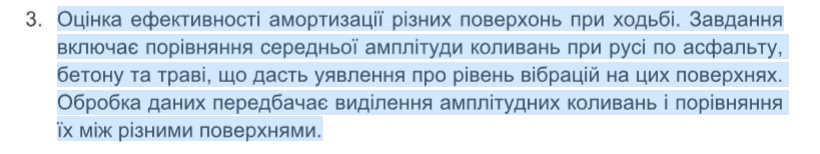
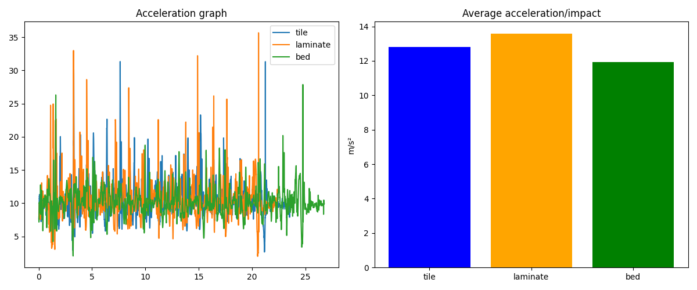

# PR6

## Варіант 3.

У цій роботі було розглянуто практичні аспекти збору та аналізу реальних фізичних даних, отриманих за допомогою сенсорів
мобільного телефону. Основна мета полягала у дослідженні ефективності амортизації різних поверхонь шляхом вимірювання
прискорення під час руху. На відміну від використання штучно згенерованих наборів даних, цей підхід дозволив
проаналізувати реальні фізичні процеси та оцінити рівень вібрацій на різних типах покриття.

Першим кроком став процес збору первинної інформації. Для цього було використано мобільний додаток Phyphox, який
дозволяє перетворювати смартфон на повноцінну вимірювальну лабораторію. За допомогою датчика акселерометра було
зафіксовано показники абсолютного прискорення при взаємодії з трьома різними поверхнями: плиткою, ламінатом та ліжком.
Зібрані дані були експортовані у форматі CSV для подальшої програмної обробки, що забезпечило точність та послідовність
аналізу.

Другим етапом стала програмна обробка отриманих результатів. Основна логіка полягала у виділенні амплітудних коливань,
які відповідають моментам найбільшого фізичного впливу (ударам). Для цього було використано метод пошуку піків
find_peaks, який дозволив автоматично ідентифікувати сплески прискорення, що перевищують рівень земного тяжіння. Такий
підхід дав змогу відфільтрувати незначні коливання та зосередитися на значущих показниках енергії удару. Обчислення
середнього значення цих піків дозволило отримати порівняльну характеристику для кожної поверхні.

Для фінальної оцінки результатів було проведено візуалізацію даних. Побудова графіків прискорення у часі дозволила
наочно побачити різницю в амплітуді та частоті коливань для кожної поверхні, а порівняльна діаграма середніх значень
підтвердила гіпотезу про різний рівень поглинання вібрацій. Аналіз показав, що тверді поверхні, такі як плитка,
демонструють значно вищі пікові навантаження порівняно з м'якими поверхнями, що свідчить про їх низьку амортизаційну
здатність.

Висновок: Виконана робота продемонструвала ефективність використання сучасних мобільних пристроїв як інструментів для
наукових досліджень. Поєднання методів прямого збору даних з їх автоматизованою обробкою через пошук пікових значень
дозволяє об'єктивно оцінювати фізичні властивості матеріалів. Отримані результати підкреслюють важливість етапу
фільтрації та виділення ключових ознак у задачах аналізу реальних часових рядів.