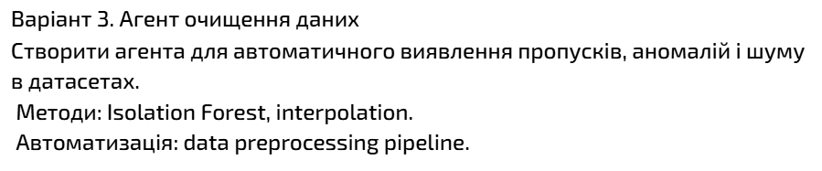
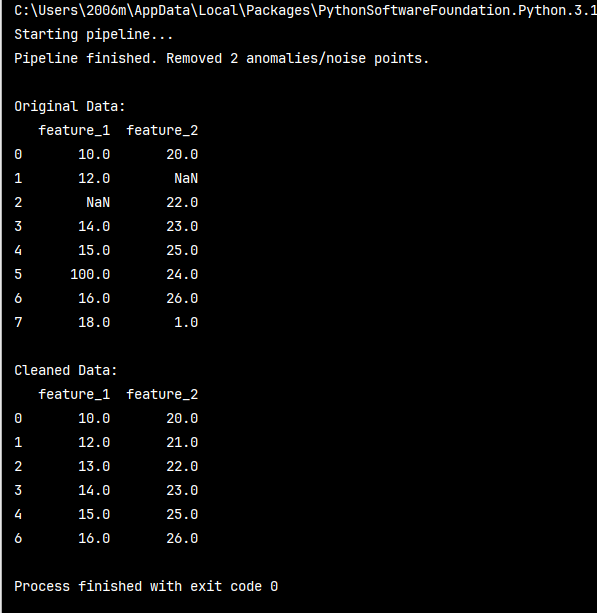

# Mini Project

## Варіант 3.

У цій роботі було розглянуто практичні аспекти створення інтелектуальної системи для автоматичної підготовки та очищення
даних. Основна проблема, яку вирішує цей агент, полягає в тому, що реальні набори даних майже завжди містять пропуски,
шуми або аномальні значення. Наявність таких дефектів може призвести до хибних висновків під час аналізу або значно
знизити точність прогнозів, тому створення автоматизованого ланцюжка очищення є критично важливим етапом.

Першим кроком у роботі агента стала реалізація механізму обробки пропущених значень. Для цього було застосовано метод
інтерполяції, який дозволяє не просто заповнювати пусті клітинки фіксованими числами, а обчислювати їх на основі
логічного зв’язку між сусідніми точками даних. Це допомагає зберегти цілісність трендів та природну структуру
показників. Додатково було передбачено використання медіанних значень для тих випадків, де інтерполяція неможлива, що
забезпечує стійкість системи до критичних відхилень у наборі даних.

Другим етапом стала побудова системи виявлення аномалій за допомогою методу Isolation Forest. Цей підхід базується на
принципі ізоляції підозрілих об'єктів від основної маси даних. Оскільки аномалії та шуми зазвичай зустрічаються рідко і
сильно відрізняються від нормальних спостережень, алгоритму легше "відділити" їх від решти даних. Це дозволяє
автоматично ідентифікувати точки, які можуть бути результатом технічних збоїв або помилок вимірювання, та позначати їх
як небажаний шум, що підлягає видаленню.

Фінальна частина роботи полягала в об'єднанні цих етапів у єдиний автоматизований конвеєр обробки. Завдяки створенню
послідовного процесу, агент спочатку відновлює втрачену інформацію через інтерполяцію, а потім проводить глибоку
перевірку на наявність аномалій, видаляючи все сміття з датасету. Такий підхід дозволяє отримати на виході повністю
очищені дані, готові для подальшої побудови професійних моделей або візуалізації.

Висновок: Виконана робота продемонструвала переваги автоматизованого підходу до підготовки даних. Поєднання методів
інтерполяції та Isolation Forest дозволяє ефективно боротися з пропусками та викидами без необхідності ручного втручання
в кожен окремий рядок. Це значно підвищує якість інформації, мінімізує вплив помилок на результат та забезпечує надійну
основу для будь-якого аналітичного дослідження.